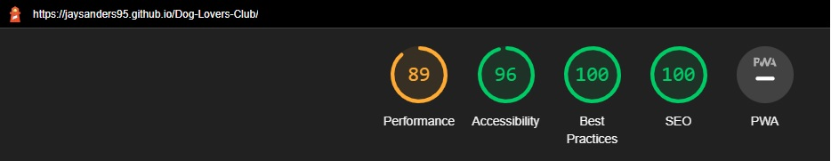

# Dog Lovers Club

The Dog Lovers' club is a community and service for dog owners, it offers one-off services such as simple walks or subscription services for five days a week walks, grooming and feeding of the dogs.

Users of this site would be able to see a brief overview of what the mission statement is for the website; this includes services that are offered, where to find the centre and a message from one of the community members of the week. Also there are direct links to the social media pages, that will open in a new tab and a live google maps location for the user to find the address. (I used a landmark for the assessment example page)

## NAVIGATION

- The navigation bar is shown at the top of the page once it renders and will follow the user down the screen, remaining at the top of the screen for ease of access to all the available sections of the page.
- The links are for Home, which takes the user to the very top of the page. This can also be accessed by clicking on the "Dog Lovers' club" text at the top of the page. The other links are 'About' which will take the user to the about section, 'services' to show what services the site has to offer and 'community' which is the member of the week section with a small bio of text. they are clearly labelled and centered for ease of use.
-The font used in the navigation bar is 'Overpass' and matches that of the rest of the website, the only other font used in this website page was 'Exo 2' which was used for the logo. The main used color for all fonts was 'whitesmoke' which contrasts nicely with the background, which is a type of smoke grey. 
- Once rendered in a different size, the logo and the text will auto shrink in size to fit nicely for the user aesthetic.
- When the user hovers over any of the links, the cursor will change to a pointer, promting the user that the links are clickable.
- Also, when the user hovers over the links in the navigation bar, the background colour changes to that of the text and the text colour changes to red. 

## Header

- The header was mainly the navigation bar with the logo cleanly above the navigation buttons.
- The main focus of this was to clean and as efficient as possible, only putting vital information in front of the user without overloading them with information.
- The main focal point of the website is an image in the centre of the screen above the 'about us' section.
- When the screen is rendered at a smaller size, it will set to contain and shrink with the size of the screen.

## About us

- Within this section was split into 3 parts; "who we are" which explains what the community is and what basic services we offer.  'clean' which informs the user that we offer more services than just walking dogs & 'longer than a day' which  informs the user that we offer services such as dog-sitting.
- When the user hovers above each category in this section, the opacity will change over a small transition period, adding interactivity to this section.
- Once the screen size has been rendered, they will render vertically so the text will fit nicely for the users view.

## Services

- This section shows 3 individual squares across the page, one for the most basic service "just a walk", one for the "monthly service" which in a short paragraph informs the user for a monthly fee they will get 5 walks a week and we offer a grooming service included. The last section is "emergency services" and the user is not shown a price, this would be a difference in price depending on the length of dog-sitting. 
- All three sections have a 'let's go' button, which if was coded would take the user to a payment screen/login screen if not logged in/booking screen. However, when the user hovers over the button, the colour turns red to match that of the navigation bar, showing the user that it is a link that can be clicked and the cursor changes to the 'pointer' further prompting the user it is a clickable link.
- The text for the services matches the same colour scheme for the rest of the text (whitesmoke) and is also displayed on the same background colour for the logo and nav bar, keeping a consistent colour for the website.
- Once the screen size is rendered, they will auto-align into columns and display horizontally with a nice balanced view with space inbetween.
- When the user hovers above each category in this section, the opacity will change over a small transition period, adding interactivity to this section as shown in the screenshot above.

## Community

- This section shows 'Member of the week' designed to show the page more like a community offering a service, rather than just a service. it is displayed with an image of a girl smiling, and a 'background' for the member.
- This is displayed the same for a normal PC user as the text will always remain underneath the picture and both will shrink to meet the screen size.

## Where to find us
- This section is code taken from google maps, upon choosing a famous place in liverpool (Goodison Park), i had embed the HTML link from this and copied it directly into my HTML.
- This will give the user an interactive map to which they can scroll around the area to see what landmarks are nearby to make getting there easier.
- This also gives the user the opportunity to visit Google Maps directly with the pin still dropped at the location without forcing the user to leave the page, this will open in a new tab.
- The only changes i had made to the code was that i increased the width to 100% so it spans across the entire page and when the screen size is reduced, it nicely shrinks.

## Footer

- This section is at the bottom of the page and remains at the bottom of the page when the user is nearer the top.
- The width mimics that of the navigation bar, so it stretches the entirety of the screen and the color scheme matches exactly, to give it a nicer aesthetic feel when viewing. The same background colour and 'text' colour for the navigation bar, 'services' and 'about us'.
- Although there is no text in the footer, the 'text' colour is used on the clickable social media icons, taken from FontAwesome and modified larger. When these links are clicked, they do not navigate the user away from the page, rather it opens a new tab with the _blank attribute.
- To follow the :hover colour scheme for all links, when the user hovers over the social media, the same red background as the other links in the page will appear and the cursor will change to a pointer.

# Testing
- I tested this page across multiple devices and multiple browsers, this includes 4 iPhones, 5 Samsung devices, 2 Google devices, Mac safari, Google chrome, Internet Explorer & Samsung Internet. The 'hover' parts of the code were activated when the sections were pressed to give the same effect.

- I can confirm that the page rendered nicely across all devices, except when dark mode was turned on, this would display a negative image colour contrast against the images/divs. This problem only happened once and was fixed when Dark Mode was deactivated.

- I can also confirm that all of the buttons worked across all devices, navigation took the users to the correct place. The "let's go" buttons correctly sent the users back to the main part of the page as the secondary links have not been added to the project.

# Key project goals
- The desired outcome of this project was to create a website for the average working person, sometimes they do not have time to walk their dog or groom their pets. This fictional service offers just that, if i had more time to complete this project i would have implemented a "username/password" login pop-up for users and a second page for new users to join. There would have been a third page for a payment & booking screen, this would have given the users the opportunity to 'book a slot' for when they wanted their dog walked or groomed and pay for the service upon booking. There also would have been scope to book a week, or two weeks etc. for the emergency services, offering a service that would house dogs and the price would differ depending on the size of the dog, how long they needed to be housed and whether regular grooming was wanted. Unfortunately, this would have taken longer than i had available.

## Fixed bugs
- When my page was deployed, my image pathway was broken and it would not show up on the active webpage. When i realised it would not run i had to find what was causing the issue. As one out of the two images had loaded, i realised it was directly the CSS that was preventing the image from loading. The original image pathway was broken, so i uploaded a new image and carefully changed the CSS to add this.
- The Hero image would not render properly when viewed on a smaller screen, it would chop half of the picture away from it. When i was checking back through my CSS, i had the image fixed and i changed this to contain, this way the image would wrap nicely around the viewport.
- 

# Validator testing
## HTML
- HTML passes the validation checks through the official W3C validator.

## CSS
- CSS passes the validation checks through the official Jigsaw validator

# Accessibility
- I can confirm that the lighthouse score i have received is listed below and it meets almost perfect for accessibility. This is shown in easy to see background/foreground colour contrasts and aria labels / alt attribute for my links. 

# Unfixed bugs
- There are no unfixed bugs that i am aware of.

# Deployment
- The site was deployed to Github pages, the steps were as follows;
-- In the github respository, above the files i clicked the settings icon, within this page there is a link to "pages" and from there i clicked the drop down menu and selected "main". After a refresh of the page, the link was available.

The link for my page is here https://jaysanders95.github.io/Dog-Lovers-Club/

# Credits
- The images that were used for this project were from 2 separate sources, the main focal image was taken from google images and the community image was taken from pexels.
- The idea for the Google maps icon across the bottom was taken from the Love Runnigng project, but the code is credit to Google maps, i used the embed code after selecting a landmark on their site. From this i took a direct HTML embed code, the only changes i made to this was the size.
- The transition code for my project for the divs was written by my mentor; Jubril. Who showed me how to do this in a mentoring session and coded one of the sections, from there i copied the code and modified it to fit mine.
- The icons around the logo and those of the social media buttons were taken from FontAwesome.
- The two fonts that were used in the project were taken from GoogleFonts

